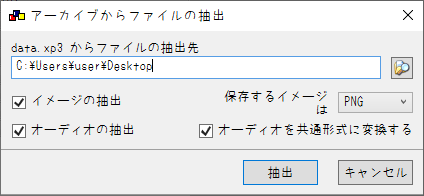

# KIRIKIRI2ONS_unclesheep_mgirlm

## なにこれ
  2020年に羊おじさん倶楽部様から発売された、15禁PC向けノベルゲーム'[魔女魔少魔法魔](https://unclesheepclub.web.fc2.com/letters/mgirlm/mgirlm.html)'を<br>
  ONScripter形式へ変換するためのコンバータです<br>

## 再現度
原作との主な違いは以下
 - 低解像度機種での文字潰れを防ぐため文字は原作より大きめ<br>
 (default.txtを微修正することで元に戻せます)
 - 一部特殊な立ち絵表示/特定場面での文字拡大未実装
 - オプション/音楽再生モード未実装
 - スタッフロール未実装


## 使い方
 1. 適当な作業フォルダを作成
 2. [GARBro](https://drive.google.com/file/d/1gH9nNRxaz8GexN0B1hWyUc3o692bkWXX/view)でdata.xp3を作業フォルダへ展開<br>

     設定は以下の通り↓<br>
     

 3. 展開先のディレクトリで[このコンバータ](https://github.com/Prince-of-sea/KIRIKIRI2ONS_unclesheep_mgirlm/releases/latest)をDL/起動させ変換(一瞬で終わります)<br>
    変換前の時点で以下のような構成になっていればOKです↓<br>
```
C:.
│  default.txt
│  KIRIKIRI2ONS_unclesheep_mgirlm.exe
│  
└─data
    │  startup.tjs
    │  
    ├─bgimage
    │      A_86.png
    │      (～略)
    │      黒.png
    │      
    ├─bgm
    │      zigoku1.ogg
    │      (～略)
    │      zigoku9dummy.ogg
    │      
    ├─fgimage
    │      のろいx.png
    │      (～略)
    │      舟越開笑閉xx.png
    │      
    ├─image
    │      1.png
    │      (～略)
    │      魔女魔少魔法魔7.png
    │      
    ├─rule
    │      114.png
    │      (～略)
    │      ～このファイルは削除してかまいません～.txt
    │      
    ├─scenario
    │      AfterInit.tjs
    │      (～略)
    │      スタッフロール.ks
    │      
    ├─sound
    │      game_center.ogg
    │      (～略)
    │      鳥1.ogg
    │      
    ├─system
    │      AnimationLayer.tjs
    │      (～略)
    │      YesNoDialog.tjs
    │      
    └─video
            ～このファイルは削除してかまいません～.txt        
```
 4. ウィンドウが消え、0.txtができれば完成<br>
    exe等の不要データを削除し、変換済みファイルと共に利用ハードへ転送

## 注意事項
 - 当然ですが公式ツールではありません
 - __DLSite DL版で動作確認しています__ その他の動作は未確認
 - 本ツールの使用において生じた問題や不利益などについて、作者は一切の責任を負いません
 - 制作サークル様に迷惑をかけたくないので、<br>
   本ツールのSNS等での拡散は**ご遠慮ください**<br>
   ~~(拡散されるほどのツールでもない気はするが一応)~~<br>

## その他
本作の変換を追加でサポートする[PSP向け自動変換ツール作ってます](https://github.com/Prince-of-sea/ONScripter_Multi_Converter)<br>
もしPSPで遊ぶ場合はぜひご利用ください(v1.3.0以上推奨)